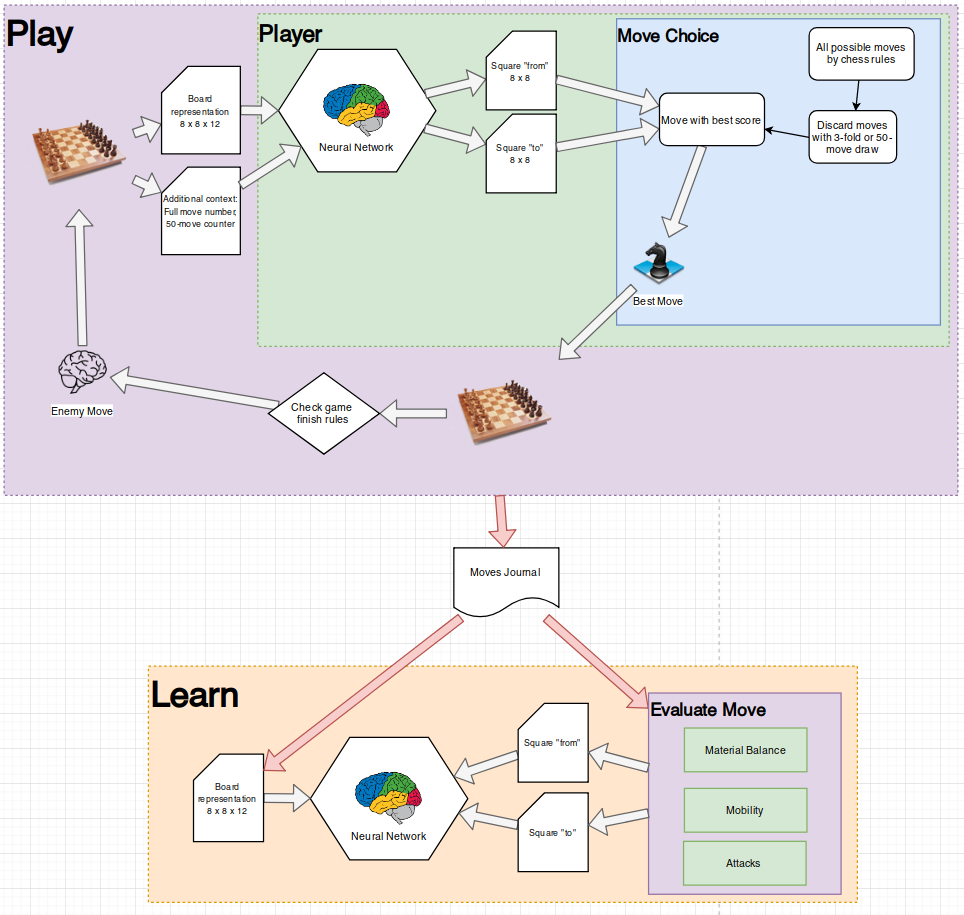
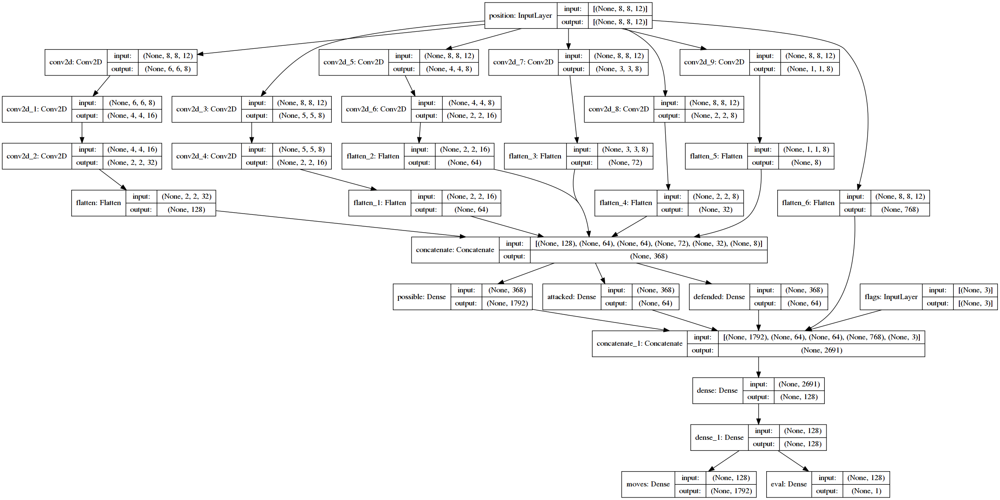

# Chess Engine with Neural Network

## Motivation

It is inspired by TCEC Season 14 - Superfinal, where Leela was trying to fry Stockfish. [Stockfish](https://stockfishchess.org/) is chess engine that dominates among publicly available engines since 2014. Stockfish uses classic approach of chess engines, where everything is determined by algorithms built into engine. [Lc0 aka Leela Chess Zero](http://lczero.org/) is different, since it uses some sort of trainable neural network inside, as well as appealing human-like nickname. Mid-series, Leela managed to take the lead by 1-2 points, and there is a chance NN-powered chess engine will finish heuristics-based dominance (78/100 games played so far).

I wanted to demonstrate my 7yr-old daughter that making these computer chess players are not as hard. We drew a diagram of playing and learning with NN and I started implementing it. The idea is to have practice and fun, make own mistakes, have discussions with daughter about planning and decision making. 

I understand there is ton of research done for centuries on all of the things I say below, I deliberately choose to make my own research for the fun of it.

## Diagram

## Journal

### Feb 15, 2019
First commits of the code.
Using own representation of chess board as 8 * 8 * 12 array of 1/0 values. 1/0 are used as most distinctive input for NN about piece presence at certain square. NN uses two hidden layers 64 nodes each. Output of NN is 8 * 8 array for "from cell" and 8 * 8 array for "to cell" scores. A piece of code is used to choose best move that a) is by chess rules; b) has best score of "from" multiplied by "to" output cells. Finally, board state is checked for game end conditions of checkmate or 50-move rule.

Model structure:

Two copies of NN are used, one plays as White and one as Black, playing versus each other. Game is recorded as PGN file, to be able to review it by human.

### Feb 16, 2019
Daughter decided that both NN copies urgently need girl-ish names. White is Lisa, black is Karen.
I decided that writing chess rule checking and move validation is not the goal of this project. Threw away my code for it, in favor of [python-chess](https://python-chess.readthedocs.io/en/latest/) library. This shortened code x3 times.

Engines are playing with each other, after each game they take move log and NN learns from it, assuming *all moves of lost game were bad, all moves of won game are good*, moves from draw are slightly bad (to motivate them search for better than draw).

A web UI is added along with small API server to be able to play with White versus Karen, to try her. Lisa vs Karen are left to play with each other and learn overnight.

### Feb 17, 2019
They played 12700 games overnight. Watching their game recordings shows they are doing a lot of dumb moves with same piece back and forth, making no progress unless they approach 3-fold or 50-move, when program forces to discard drawish move.

It seemed that it's deeply wrong to teach NN that any move from victorious game is good. I wanted to avoid this originally, but to make progress, we need to introduce some sort of *position evaluation*, so engine will learn to tell good moves from bad moves.

With daughter, we outlined some rules of evaluating position:
1. Pieces have different value
2. Capturing enemy piece is very good
3. Attacking enemy piece is good
4. Putting yourself under attack or removing defence from your piece is bad
5. Increasing squares under our control is good
6. Moving pawn forward is slightly good as it is the way to promote

We started with material balance, taking possible square control as value of the piece: 
 - Pawn: 1
 - Knight: 8
 - Bishop: 13
 - Rook: 14
 - Queen: 27
 - King: 64 - special value to reflect it's precious

Since we analyze game after all moves are done, we judge move by what was the consequence after opponent's move. We calculate sum of all our piece values, subtracting all enemy piece values, so we get *material balance*. Learning for ~3000 games shown that NNs definitely learn to capture pieces a lot, so the principle of evaluation works and reflects into NNs move score predictions. Material balance addresses #1, #2 and #3 of our evaluation rules.

Next is to take *mobility* into account, to cover rules #3, #4, #5, #6 from above list. It is quite easy to implement, again we take state after opponent's move and we look now many moves can we make versus how many moves are there for opponent. Attacks are counted in a similar way, we assume that if piece is under attack, it adds *half* of its value to mobility score. This gives us "mobility balance".

Now it gets tricky, since we need to combine material balance and mobility balance to get overall score for position. Current solution is to multiply material balance by 10 and sum with mobility balance. Gut feeling tells me it's not right, but let's see what NN will learn.

Bots are left to play overnight again.

### 18 Feb, 2019

They've played ~32000 games. Quick game versus Karen shows that still NN miss obvious attacks and loses after human quickly. But this time it does a lot more captures, moves pieces more consistenly forward, does less "dumb cyclic moves".

Watching games of Lisa vs Karen shows consistent pawn promotions and a lot of captures from both sides. Still most of obvious attacks, exchanges are missed. End game is completely dumb, falling into cyclic moves still.

I did series of experiments with NN structure, looking if making it deeper or wider would help. But ~10000 games shows that neither 3-layer, nor 128-node NN does better. 

It's time to summarize what was done over past days:
  - building this kind of NN-driven test engine is super-easy
  - the rules we put as criteria for learning do affect engine move making
  - we should research/experiment with evaluation approach more
  - we should experiment with NN structure more, maybe use LSTM instead of feed-forward
  - re-learning from last N games might be better than incremental learning from very last game
  - turning game representation to "always one side" and using exactly same NN for game might make it more robust and universal

### 22 Feb, 2019

Decided to make sing NN that will be able to decide for both sides, using board and move flip for black.

NN structure changed to 6-layers decreasing from 768 to 128 nodes.